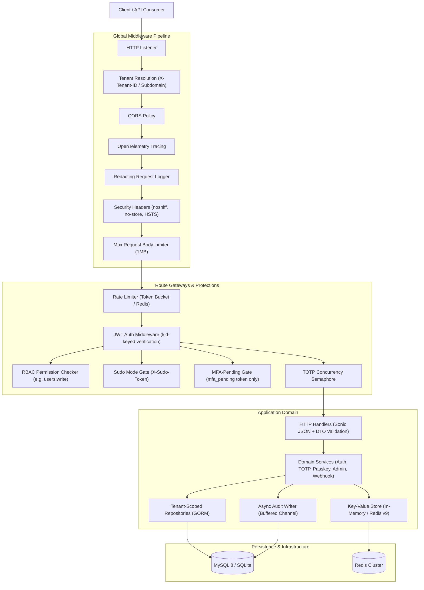

# FinnApiGo Architecture Guide

This document outlines the architectural patterns, security designs, and package boundaries in **FinnApiGo**.

---

## 1. System Runtime Flow

FinnApiGo enforces strict transport-to-domain separation: HTTP adapters parse and validate payloads, services own business rules and cryptographic policies, and repositories perform context-aware database queries.

---

## 2. Package Boundaries & Responsibilities

- **`cmd/server`**: Composition root. Reads configuration, initializes database and keysets, wires dependencies, launches background workers (audit flush, session/token cleanup), and handles graceful OS signal shutdown.
- **`cmd/migrate`**: Standalone database migration CLI using embedded SQL files (`up`, `down`, `force`, `version`).
- **`internal/config`**: Strongly-typed Twelve-Factor configuration with fail-fast startup validation.
- **`internal/tenant`**: Multi-tenancy context helpers (`WithTenantID`, `TenantFromContext`) ensuring multi-tenant isolation throughout the service and persistence layers.
- **`internal/handlers`**: HTTP presentation layer. Encapsulates request binding with `bytedance/sonic`, DTO field validation, and uniform response generation via `internal/response`. Handlers never import GORM directly.
- **`internal/services`**: Pure domain logic (authentication, TOTP, Passkey, Admin, Trusted Devices, Webhooks, Notifier, CAPTCHA). Contains zero Gin dependencies (enforced by `depguard` linter).
- **`internal/repositories`**: Context-aware GORM adapters handling database queries with explicit tenant scoping and LIMIT-batched deletion routines for retention purges.
- **`internal/middleware`**:
  - `TenantMiddleware`: Extracts tenant ID or slug from headers or subdomains.
  - `AuthMiddleware`: Validates Bearer access tokens, enforces password-version freshness (`pwd_version`), and verifies session revocation against the denylist.
  - `RequirePermission`: Enforces RBAC permissions dynamically.
  - `SudoMiddleware`: Requires a valid elevated `X-Sudo-Token`.
  - `MFAPendingMiddleware`: Restricts access exclusively to single-use `mfa_pending` JWTs.
  - `RateLimiter`: Sliding-window and token-bucket rate limiter with store fail-open semantics.
  - `ConcurrencyLimiter`: Semaphore capping parallel CPU-bound cryptographic operations.
  - `SecurityHeaders`: Emits `X-Content-Type-Options`, `Referrer-Policy`, `Cache-Control: no-store`, and HSTS.
- **`internal/store`**: High-performance key-value abstraction (`Get`, `Set`, `SetNX`, `IncrBy`, `Delete`). Default `InMemoryStore` for single instances; `RedisStore` for clustered deployments.
- **`internal/hash` & `internal/crypto`**:
  - `hash`: Bcrypt password hashing with configurable cost (`hash.HashPasswordWithCost`) and SHA-256 token hashing.
  - `crypto`: AES-256-GCM authenticated sealing and unsealing for secrets at rest (TOTP seeds and recovery codes).
- **`internal/jwt`**: Keyset-aware JWT issuance and verification (`kid` stamping, `JWT_SECRET_PREVIOUS` fallback, HS256-only enforcement).
- **`internal/logging`**: Redacting `slog.Handler` decorator replacing sensitive parameters (passwords, tokens, codes, keys) with `[REDACTED]`.
- **`internal/metrics`**: Prometheus metrics registry and exposition handler.
- **`internal/apidrift`**: Bidirectional route-to-OpenAPI contract drift verification.

---

## 3. Security-Critical Decisions

### 3.1. Tenant Isolation
Every database query in multi-tenant mode filters on `tenant_id`. Tenant context is populated early in the request lifecycle (`internal/middleware/tenant.go`) and propagated through Go's `context.Context`. Repositories verify that operations cannot mutate entities across tenant boundaries.

### 3.2. Passkey Clone Detection (W8)
In compliance with FIDO2 / WebAuthn specifications, authenticators store a monotonic signature counter incremented upon each authentication event. During verification (`POST /api/v1/auth/mfa/passkey/authenticate/verify`):
- The counter reported by the authenticator is verified against the database.
- If `assertion_counter <= stored_counter` (and counter > 0), the authenticator has likely been cloned.
- The service immediately invalidates the credential, emits a security audit event (`passkey.clone_detected`), and terminates the request.

### 3.3. GitHub-Style Sudo Mode
High-privilege actions (regenerating recovery codes, revoking passkeys, deactivating accounts) are gated by `X-Sudo-Token`. Users must verify their primary password or TOTP code within a short window (default 15 minutes) to mint this elevated token. Stolen API access tokens alone cannot strip security credentials.

### 3.4. Refresh Token Rotation & Theft Response (C1/C2)
Refresh tokens are opaque high-entropy random strings stored exclusively as SHA-256 hashes. Upon presentation at `/api/v1/auth/refresh-token`:
1. The token is checked and marked as used via an atomic compare-and-set update.
2. If an already-consumed refresh token is presented, the system triggers a **theft response**: every active session and refresh token for that user is immediately revoked, and an audit event is logged.

### 3.5. Outbound Webhook SSRF Defense
To prevent Server-Side Request Forgery (SSRF) when webhook subscriptions are registered:
- Destination URLs are resolved using standard DNS lookup.
- If the resolved IP maps to loopback (`127.0.0.0/8`, `::1`), link-local (`169.254.0.0/16`), or private RFC 1918 subnets (`10.0.0.0/8`, `172.16.0.0/12`, `192.168.0.0/16`), registration is rejected with `400 Bad Request`.

### 3.6. Store Failure Semantics (A1)
The application applies split failure postures to `store.Store` outages:
- **Rate and velocity limits fail OPEN**: Redis outages must not take down the core authentication service. The system falls back to process-local token buckets.
- **Single-use token guards fail CLOSED**: A store failure must never allow token replay (such as password reset or email verification tokens).

---

## 4. Test Execution & Performance Architecture

To maintain high continuous-integration velocity without compromising security:

1. **Bcrypt Cost Parameterization (`BCRYPT_COST`)**:
   - Production defaults to `bcrypt.DefaultCost` (cost 10) or operator-configured cost.
   - Test suites initialize services with `bcrypt.MinCost` (cost 4).
   - This architectural change reduced total uncached test execution time across 28 packages from **181 seconds down to ~20 seconds**.
2. **Zero-Sleep Synchronization**:
   - Concurrency, rate limiting, and background worker test cases use channels and synchronization primitives rather than arbitrary `time.Sleep` calls.
3. **Pure-Go SQLite Testing**:
   - High-level integration tests (`tests/integration/`) run against in-memory SQLite (`github.com/glebarez/sqlite`) requiring no CGO, enabling instant cross-platform execution on Windows, macOS, and Linux.
4. **API Drift Verification**:
   - `internal/apidrift` compiles the live Gin engine and verifies that all 48 operational routes match `docs/openapi.yaml` in both directions on every CI build.
