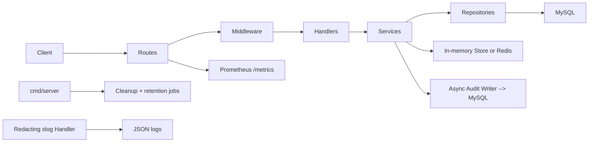

# FinnApiGo Architecture

## Runtime flow

The application enforces a transport-to-domain flow: handlers parse and validate HTTP, services own business decisions, and repositories perform persistence only. `context.Context` flows from handlers through repository I/O.

## Package boundaries

- `cmd/server`: composition root, key resolution (K1), dependency wiring, background jobs, pprof server, lifecycle, and shutdown.
- `internal/config`: typed twelve-factor configuration with fail-fast validation — `JWT_SECRET` is mandatory, invalid numeric/duration/bool values refuse to boot (R2), `DB_TLS` and `KEY_PROVIDER` values are enum-checked.
- `internal/handlers`: HTTP adapters. Constructors accept handler-owned service interfaces, enabling isolation from the database in HTTP tests. `dto.go` owns every request/response payload struct with explicit max lengths.
- `internal/services`: authentication, TOTP MFA, notification, CAPTCHA, disposable-domain checks, and policy rules. Gin is banned here (depguard enforces).
- `internal/repositories`: context-aware GORM persistence adapters, plus LIMIT-batched delete helpers for the purge jobs (P1).
- `internal/store`: TTL-aware state abstraction (`Get`/`Set`/`SetNX`/`IncrBy`/`Delete`). `InMemoryStore` is the default; `RedisStore` shares replay guards, velocity windows, and per-IP counters between instances. Failure semantics are split (A1): counters fail open, single-use guards fail closed.
- `internal/jwt`: purpose-bound JWT issuance and verification over a versioned keyset (K2) — `kid` header on issue, `JWT_SECRET` + optional `JWT_SECRET_PREVIOUS` on verify, HS256-only (C5).
- `internal/hash` and `internal/crypto`: one-way primitives (bcrypt, SHA-256 token/recovery-code hashing, constant-time compare) versus reversible AES-256-GCM sealing for at-rest secrets that must be re-read (recovery codes, TOTP secrets — C7).
- `internal/logging`: redacting `slog.Handler` decorator (G2) — secret-shaped attribute values become `[REDACTED]` before reaching any sink.
- `internal/metrics`: Prometheus registry construction (P2); counters wrap atomics maintained at runtime. Metrics carry no user-identifying labels (G2).
- `internal/middleware`: auth, MFA-pending, sudo, rate limiting (process-local token bucket + shared store counter path), security headers (A3), and the TOTP concurrency semaphore.
- `internal/routes`: route registration, request logger (safe fields only, request-ID correlation), trusted-proxy handling.
- `internal/apidrift`: contract drift check — builds the real router and diffs it against `docs/openapi.yaml` (A1).
- `internal/database`: GORM/MySQL connection plus the embedded golang-migrate runner (R1).
- `migrations/`: embedded SQL migration pairs applied by `cmd/migrate` as the deploy step.
- `internal/device`, `internal/geo`, `internal/response`: focused single-purpose packages (UA parsing, mockable geo resolution, response envelope).

## Security-critical decisions

- **Key isolation (K1)** — release mode refuses to boot without an explicit `RECOVERY_CODE_KEY`; the JWT-secret derivation fallback exists only in dev, loudly. One leaked secret no longer unravels both token integrity and sealed-secret confidentiality.
- **JWT rotation (K2)** — signing stamps a `kid` (SHA-256 fingerprint, not secret material); verification resolves keys from the versioned keyset, so `JWT_SECRET_PREVIOUS` keeps pre-rotation tokens valid until expiry.
- **Secrets at rest** — TOTP secrets and the re-viewable recovery-code copies are sealed with AES-256-GCM under `RECOVERY_CODE_KEY`; refresh tokens and recovery-code *verification* use SHA-256 (high-entropy inputs do not need a slow KDF).
- **Rotation under concurrency (C1/C2)** — refresh revocation and recovery-code consumption are compare-and-set updates; parallel double-use attempts yield exactly one winner, and reuse of a rotated refresh token revokes every session (theft response) and is audited.
- **Store failure semantics (A1)** — rate/velocity counters fail open (Redis outage must not become an auth outage; the shared limiter falls back to its process-local bucket), while single-use guards fail closed (a store outage must never replay a consumed token).
- **Brute-force defense in depth** — per-IP token bucket + shared fixed-window counters (C4 TTL anchoring), per-account and TOTP attempt windows (successes never feed them — C9), exponential lockout backoff, adaptive CAPTCHA, concurrency-gated TOTP validation.
- **Enumeration resistance** — timing-equalized login for unknown accounts, identical forgot-password/resend-verification responses, honeypot + velocity caps on registration.
- **Logging guarantees (G2)** — request logs emit only safe fields; a structural redaction handler guarantees secret-shaped attributes never reach the sink regardless of call-site discipline; metrics carry no user-identifying labels.
- **PII governance (G1)** — `audit_logs` carry PII; release mode without `AUDIT_RETENTION_DAYS` warns at boot; the durable-queue upgrade path is designed (`docs/audit-durable-queue-design.md`) but deliberately not implemented.
- **Public API contract (A1)** — `docs/openapi.yaml` is the contract of record; the `internal/apidrift` test fails CI when the router and the spec diverge in either direction.
- Passwords use bcrypt and are rejected above 72 bytes so bcrypt truncation cannot equate distinct credentials.
- Public auth flows avoid account enumeration. Verification resend combines per-email, shared per-IP, and global volume caps; rejected abuse is audited.
- Request logging emits only method, path, status, latency, client IP, and request ID via structured (slog JSON) logs.

## Data-layer notes (D1)

Every hot-path query is index-served (asserted against real MySQL by the
integration suite, which fails on a full-scan plan):

| Query | Plan |
|---|---|
| `FindByHash` (rotation lookup) | `const` on `uni_refresh_tokens_token_hash` |
| CAS revoke (rotation) | `range` on `PRIMARY`, rows=1 |
| `FindActiveByUser` | `ref` on `idx_refresh_tokens_user_id` |
| Purge `expires_at <` / `created_at <` | `range` on the respective index, covering |
| Audit by user | `ref` on `idx_audit_logs_user_id` |

The rotation repository deliberately stays on GORM: the ~14 ms/rotation
benchmark is round-trip-dominated, so a raw-SQL rewrite would save
microseconds while duplicating SQL.

## Testing strategy

- **Unit** — hash, config, response, handler, route, service, store, middleware, and repository packages; handler tests use fakes through narrow interfaces; service tests use in-memory fakes; repository tests use fresh pure-Go SQLite databases.
- **Integration (`-tags=integration`)** — real MySQL + Redis (service containers in CI, `TEST_MYSQL_DSN` / `TEST_REDIS_URL` locally): migration up/down/re-up (T1), EXPLAIN plan assertions (D1), Redis fixed-window/guard semantics. Skipped automatically when the env vars are unset.
- **Fuzzing (T2)** — three targets with property invariants (no panic, no forged type acceptance, no malformed code acceptance, consumption equals exact match); 30-second smoke per target on every CI run, longer runs locally (`go test -fuzz=FuzzX -fuzztime=...`).
- **Coverage floors (T3)** — CI enforces 73.0% (`internal/services`) and 91.0% (`internal/jwt`); raise the floors as coverage improves, never lower them.
- **Contract drift (A1)** — `internal/apidrift` diffs the registered router against the OpenAPI spec in both directions on every test run.
- **Security scans (T4)** — blocking standalone gosec and Trivy (vuln + misconfig) in CI, alongside vet, golangci-lint, and govulncheck.
- `go test -race` runs in CI (Linux); local Windows machines without a C compiler cannot run it.
