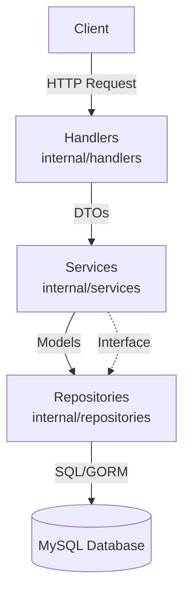

# Architecture of FinnApiGo

## Project Structure
The project follows a standard Go backend layout:
- `cmd/server/`: Application entry point and dependency wiring.
- `internal/config/`: Configuration loading and environment variable management.
- `internal/database/`: Database connection and initialization.
- `internal/handlers/`: HTTP/transport layer. Maps requests to service calls.
- `internal/middleware/`: HTTP middlewares (auth, rate limit, logging, etc.).
- `internal/models/`: Domain models and GORM entities.
- `internal/repositories/`: Data access layer (persistence).
- `internal/routes/`: HTTP route registration.
- `internal/services/`: Core business logic and interface definitions.
- `internal/store/`: Ephemeral state management (e.g., rate limits, tokens).
- `internal/utils/`: Helper functions (hashing, response formatting, etc.).

## 3-Layer Architecture
The application uses a strict 3-layer architecture:

1. **Handlers (HTTP/Transport):** Parse requests, validate DTOs, call services, format responses.
2. **Services (Business Logic):** Implement business rules, handle errors, orchestrate repositories.
3. **Repositories (Persistence):** Abstract database interactions, return domain models.

## How to Add a New Module
To add a new feature (e.g., Tier 2 User Management or a new business domain):

1. **Define Models:** Add your GORM entities in `internal/models/`.
2. **Define Interfaces:** Add repository and service interfaces in `internal/services/interfaces.go`.
3. **Implement Repositories:** Create the concrete repository in `internal/repositories/`.
4. **Implement Services:** Create the business logic in `internal/services/`, ensuring you return appropriate sentinel errors.
5. **Create Handlers:** Add HTTP handlers in `internal/handlers/` to map requests to your service.
6. **Wire Routes:** Register endpoints in `internal/routes/routes.go`.
7. **Wire Dependencies:** Instantiate repositories, services, and handlers in `cmd/server/main.go`.

## Key Conventions
- **Sentinel Errors:** Services return sentinel errors (e.g., `ErrUserNotFound`).
- **Error Mapping:** Handlers use `statusForError` to map sentinel errors to HTTP status codes.
- **Response Envelope:** All API responses follow a strict `{ "code": int, "message": string, "data": any }` format.
- **Context Threading:** `context.Context` must be passed from the HTTP request down to the repository layer (e.g., for cancellation and timeouts).
- **Audit Logging:** Important actions should be logged asynchronously via the `AuditRepo`.
- **Testing:** Unit tests use in-memory mocks (e.g., `mock_repositories`). No real database is required for unit tests. Mocks are generated/written in `_test.go` files.

## Security Patterns
- **Authentication:** JWT with distinct type claims (access, refresh, verify, reset). Single-use tokens enforced via `Store.SetNX` and a `UsedToken` DB table.
- **Password Security:** `bcrypt` hashing. Login includes dummy hash comparisons for timing attack equalization.
- **Rate Limiting & Anti-Abuse:** IP-based tracking, adaptive CAPTCHA, disposable email blocking, honeypot fields, and endpoint-specific rate limits.
- **Constant-Time Comparison:** OTP and token checks use `crypto/subtle.ConstantTimeCompare`.
- **Validation:** Strict body size caps, max-length validations on all string inputs (e.g., max 128 chars for passwords).
- **Session Management:** Refresh token reuse detection triggers a "revoke-all" on suspected theft.

## Configuration
All configuration is managed via environment variables and loaded into a typed struct in `internal/config/config.go`.
