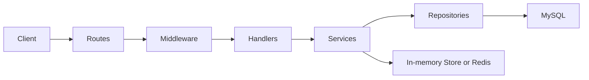

# FinnApiGo Architecture

## Runtime flow

The application enforces a transport-to-domain flow: handlers parse and validate HTTP, services own business decisions, and repositories perform persistence only. `context.Context` flows from handlers through repository I/O.

## Package boundaries

- `cmd/server`: composition root, migration, dependency wiring, lifecycle, and shutdown.
- `internal/config`: typed twelve-factor configuration; `JWT_SECRET` is mandatory.
- `internal/handlers`: HTTP adapters. Constructors accept handler-owned service interfaces, enabling isolation from the database in HTTP tests.
- `internal/services`: authentication, MFA, notification, audit, CAPTCHA, and policy rules.
- `internal/repositories`: context-aware GORM persistence adapters.
- `internal/store`: TTL-aware state abstraction; Redis shares replay and rate-limit state between instances.
- `internal/hash`, `internal/jwt`, and `internal/response`: focused primitives that replace the former generic utilities boundary.

## Security-critical decisions

- Passwords use bcrypt and are rejected above 72 bytes so bcrypt truncation cannot equate distinct credentials.
- JWTs are purpose-bound; reset and verification tokens are single-use through `jti` tracking.
- Refresh tokens are opaque, stored only as SHA-256 hashes, rotated on use, and reuse revokes all user sessions.
- Public auth flows avoid account enumeration. Verification resend combines per-email, shared per-IP, and global volume caps; rejected abuse is audited.
- Request logging emits only method, path, status, latency, and request ID. Authorization values, credentials, and OTPs are excluded.

## Testing strategy

- Hash, config, response, handler, route, service, store, middleware, and repository packages have unit tests.
- Handler tests use fakes through narrow interfaces; service tests use in-memory repository/store fakes.
- Repository tests use fresh pure-Go SQLite databases. MySQL duplicate-key translation is intentionally tested at the service boundary rather than emulated in SQLite.
- `cmd/server`, `internal/database`, and plain model structs remain composition/data-only packages; meaningful behavior is tested through repository and integration seams rather than field-existence tests.
